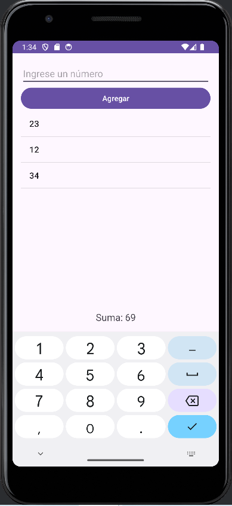

SumaLista es una aplicación Android intuitiva y funcional diseñada para gestionar y sumar listas de números dinámicamente.

Esta herramienta permite a los usuarios:
  1.- Ingresar números individuales a través de un campo de texto.
  2.- Agregar estos números a una lista visualizada en tiempo real.
  3.- Ver la suma total de todos los números en la lista, actualizada instantáneamente con cada adición o eliminación.
  4.- Eliminar números específicos de la lista con un simple toque.

Características principales:

  1.- Interfaz de usuario limpia y fácil de usar.
  2.- Lista scrollable para manejar múltiples entradas.
  3.- Cálculo automático de la suma total.
  4.- Funcionalidad de eliminación interactiva.

